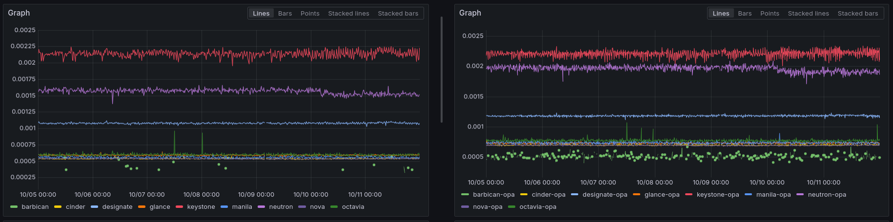

===============================================================================
Fine-grained and centralized authorization for OpenStack with Open Policy Agent
===============================================================================

Integrating OPA with OpenStack
------------------------------

OpenInfra Summit Europe 2025

:Date: 2025-10-19
:Author: Artem Goncharov, Cloud Architect, SysEleven
:Author: Adrien Cunin, SRE Public Cloud, SysEleven

Agenda
------

- Context and goals
  - Authorization in OpenStack: how it works
  - What are we trying to solve

. . .

- Open Policy Agent and OpenStack
  - Open Policy Agent (OPA)
  - ``oslo.policy`` plugin for OPA
  - Architecture
  - What's so special about Neutron

. . .

- Production experience
  - How we approached production roll out
  - Monitoring and lessons learned
  - Timeout issue

Authorization in OpenStack
--------------------------

- Handled by ``oslo.policy`` common library
- Hybrid of RBAC and ABAC
- Users have roles on projects
- Policies describe when to allow each API operation
- A set of default roles exists:
  - ``admin``
  - ``member``
  - ``reader``
- Policies are evaluated for each API request

Customizing authorization
-------------------------

- Roles can be managed and assigned via Keystone API
- Policies are defined in code but can be configured
- Policy configuration for each service is stored in ``policy.yaml``
- Changing ``policy.yaml`` requires a service redeploy (and restart for older ``oslo.policy``)

What are we trying to solve
---------------------------

- Supporting Fine grained access control more easily
  - Whatever "fine grained" means
  - Starting with service member roles
- More flexibility in managing policies
  - Central location to store and update policies
  - Ability to test policies outside OpenStack
  - No config deployment needed
- Using OPA for other services as well

Open Policy Agent (OPA)
-----------------------

.. image:: opa.svg
   :height: 200px

- CNCF project - graduated in 2021
- Policy engine

. . .

- Can be used by any application, via:
  - Embedded in your Go application
  - WASM
  - Rest API

. . .

- *Rego* language for describing policies
- Policies can be local or fetched remotely
- Decision logging
- Testing framework
- Ability to use external data within policy evaluation

Integrating OPA with OpenStack
------------------------------

- Rest API is the easiest to integrate with OpenStack

. . .

- ``oslo.policy`` has basic support for ``http`` checks - but it's broken in practice

. . .

- Introducing a new oslo.policy plugin: ``oslo.policy.opa``

. . .

- Architecture questions:
  - Where do we run OPA?
  - How many OPA do we run?
  - What if OPA is down?
  - Do we implement HA?

Architecture
------------

- Sidecar pattern
  - Kubernetes
  - systemd logic for our services

. . .

- One OPA per OpenStack API service
  - Avoid policy naming collisions
  - Smaller policy footprint for better OPA performance

. . .

- OPA listens on localhost only
  - Low latency
  - Built-in basic security
  - Currently: no TLS, no authentication

. . .

- Fail close if OPA fails (config flag)

. . .

- Performance impact: let's see in production later

Translating policy files into Rego
----------------------------------

- ``oslo.policy.opa`` also provides a Rego generator
- Uses the same parser as oslo.policy
- Translates policy into Rego language
- Generates new policy.yaml files calling ``opa:``

policy.yaml example
-------------------

Before:

.. code:: yaml

   "publicize_image": "role:admin or (role:image_admin and project_id:%(owner)s)"

. . .

After:

.. code:: yaml

   "publicize_image": "opa:publicize_image"

Rego policy
-----------

Policy:

.. code:: rego

  package publicize_image

  # PATCH  /v2/images/{image_id}
  #"publicize_image": "role:admin or (role:image_admin and project_id:%(owner)s)"

  allow if {
    #role:admin
    "admin" in input.credentials.roles
  }

  allow if {
    image_admin_and_creds_project_id_eq_input_owner
  }

  #(role:image_admin and project_id:%(owner)s)
  image_admin_and_creds_project_id_eq_input_owner if {
    "image_admin" in input.credentials.roles
    input.credentials.project_id == input.target.owner
  }

. . .

Tests:

.. code:: rego
   package publicize_image_test

  import data.publicize_image

  test_admin_or_image_admin_and_creds_project_id_eq_input_owner_0 if publicize_image.allow with input as {"credentials": {"roles": ["admin"]}}
  test_admin_or_image_admin_and_creds_project_id_eq_input_owner_1 if publicize_image.allow with input as {"credentials": {"roles": ["image_admin"], "project_id": "foo"}, "target": {"owner": "foo"}}

Managing policies as Rego files
-------------------------------

- Dedicated centralized Git repository
  - ``upstream`` branch vs our branch

. . .

- CI/CD
  - Unit testing
  - Bundle creation - tarball
  - Bundle creation - OCI container

. . .

- OPA pulls policies from our internal OCI repository
  - Refresh every 1-2 min
  - Bundles are stored locally (``persist: true``)

Why Neutron is so special
-------------------------

- Policies include custom checks:
  - Owner check
  - Field check
- Policy evaluation is handled differently

. . .

- Introducing ``neutron-db-proxy``
  - Exposes some DB data over HTTP
  - Sets Cache headers so OPA keeps data cached

Production roll out
-------------------

- Gradual roll out, per service
- Switch to OPA (same policies) first
- Rolled out updated policies for new roles, later
- Functional tests (Tempest, ...) on top of OPA tests
- Watch monitoring and logs
  - API requests and OPA requests metrics
  - OPA decisions metrics
  - Number of "not allowed" decisions

Monitoring
----------

- OPA exposes some Prometheus metrics
  - Go internal metrics
  - HTTP requests durations

. . .

- Decision logging
  - We wrote our own ``opa-decisions-exporter``
  - OPA pushes logs to ``opa-decisions-exporter``
  - ``opa-decisions-exporter`` writes logs, exports additional Prometheus metrics
    - Number of requests
    - Size of requests
    - Decision time

Performance impact
------------------

- Small additional overhead: round-trip to OPA and OPA decision time
- Decision itself is taken in microseconds (decision budget 1-2 ms)
- Full round-trip to OPA is similar order of magnitude

Timeout issue
-------------

- Logs showed ``oslo.policy.opa`` connection to OPA (on localhost!) sometimes timing out
- Only on some services: Nova, Neutron, Cinder

. . .

- Low level network debugging (tracing packets between OpenStack service and OPA)
- Hard to reproduce
- We tried:
  - Increasing the timeout
  - Bypassing some Python layers when sending the HTTP request
  - Tuning amount of green threads in the OpenStack service
  - Migrating OpenStack service to uwsgi - did not help in production
  - Introducing a retry mechanism in ``oslo.policy`` plugin

The future
----------

- Security: introducing TLS and authentication for OPA?

. . .

- Keystone to centrally manage OPA policies?

. . .

- Self-service roles?
  - What would need to change in OpenStack?
  - Visit Keystone talk from Artem today at 2:45pm

References and credits
----------------------

- OPA website: https://www.openpolicyagent.org/
- ``oslo.policy`` documentation: https://docs.openstack.org/oslo.policy/latest/
- ``oslo.policy.opa`` plugin: https://github.com/gtema/oslo.policy.opa
- Artem's blog post: https://gtema.github.io/posts/opa/

. . .

Thanks to our colleagues:

- Bodo Petermann
- Benjamin Reichel

That's it!
----------

Thank you!

Reach us at:

- Artem Goncharov <a.goncharov@syseleven.de>
- Adrien Cunin <a.cunin@syseleven.de>

Questions?
