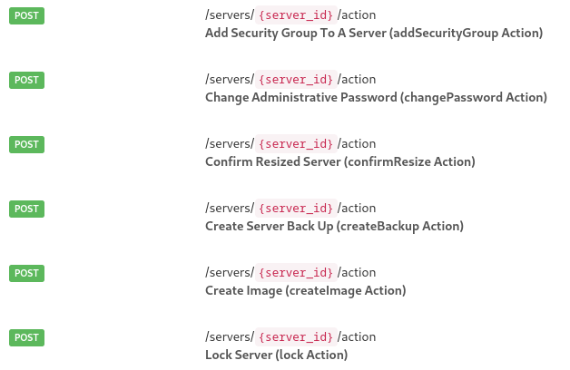

# OpenStack OpenAPI specs

Building up OpenAPI specs for OpenStack APIs


## What is OpenAPI

The OpenAPI Specification, previously known as the Swagger Specification, is a
specification for a machine-readable interface definition language for
describing, producing, consuming and visualizing web services.

### Version 3.1.0

OpenAPI version 3.1.0, released in 2021, includes JSON schema alignment what
allows it to be applied for every API with JSON schema.

## What is OpenAPI good for

- machine readable API contract
- API documentation consistent with the service code
- generation of API clients
- enables API security testing
- ease API integration into 3rd party frameworks (i.e. API Gateway)

## OpenStack API

* Every service is exposing their own individual API
* APIs are heavily unstandardized despite API-SIG effort
* non-declarative
* not directly OpenAPI compatible

## Dynamic headers

Some services (i.e. Swift) support dynamic (not pre-defined) headers to operate
on resource metadata:

```
curl -i $publicURL/marktwain/goodbye -X POST -H "X-Object-Meta-Book: GoodbyeColumbus"
```

<div data-marpit-fragment>

**OpenAPI requires all supported request and response headers to be described
explicitly (name, data type, description)**

</div>

## [Microversion](https://specs.openstack.org/openstack/api-sig/guidelines/microversion_specification.html)

> "API Microversions" allow changes to the API while preserving backward
> compatibility. The basic idea is that a user has to explicitly ask for their
> request to be treated with a particular version of the API. 
> 
> So breaking changes can be added to the API without breaking users who don’t
> specifically ask for it. 

```
curl -i $publicURL/volumes -X POST -H "OpenStack-API-Version: volume 3.70" ...
```

<div data-marpit-fragment>

**OpenAPI does not support different operations based on the passed headers**

</div>

## RPC style actions

Few OpenStack services rely on the RPC like actions where operation is routed
based on the body.

```
curl -i $publicURL/servers/fake_id/action -X POST -d '
    {
        "lock": {"locked_reason": "I don't want to work"}
    }
'
```
## RPC style actions



<div data-marpit-fragment>

**OpenAPI does not support different operations based on the request body**

</div>


## So now what?

## "X-" extensions

OpenAPI allows x-custom extensions

```
paths:
  /servers:
    put:
      ...
      x-openstack: 
        foo: bar
```

## Dynamic headers

Custom OpenAPI parameter serialization based on regex

```
...
paths:
  /foo:
    put:
      ...
      parameters:
        - in: header
          name: X-Account-Meta-*
          schema:
            type: string
          x-openstack:
            style: regex
```

## Microversions

JSON schema `oneOf` with `x-openstack` extension and custom discriminator

```
components:
  schemas:
    VolumesCreateRequest:
      oneOf:
        - $ref: '#/components/schemas/VolumesCreate_30'
        - $ref: '#/components/schemas/VolumesCreate_313'
        - $ref: '#/components/schemas/VolumesCreate_347'
        - $ref: '#/components/schemas/VolumesCreate_353'
      x-openstack:
        discriminator: microversion
    VolumesCreate_313:
      ...
      x-openstack:
        min-ver: 3.13
        max-ver: 3.47
    ...
```

## RPC Actions

JSON schema `oneOf` with `x-openstack` extension and custom discriminator

```json
components:
  schemas:
    server_actions:
      oneOf:
        - $ref: #/components/schemas/action_foo
        - $ref: #/components/schemas/action_bar
      x-openstack:
        discriminator: action
    action_foo:
      ...
      x-openstack:
        action-name: foo
    action_bar:
      ...
      x-openstack:
        action-name: bar
```

## Actions + microversions 

Just a combination of above methods.

```
components:
  schemas:
    server_actions:
      oneOf:
        - $ref: #/components/schemas/action_foo
        - $ref: #/components/schemas/action_bar
      x-openstack:
        discriminator: action
    action_foo:
      oneOf:
        - $ref: #/components/schemas/action_foo_21
        - $ref: #/components/schemas/action_foo_22
      x-openstack:
        action-name: foo
        discriminator: microversion
```

## And what's next?

## Building OpenAPI specs from service sources

- inspect source code of services
- most services have json schemas attached to the controllers
- services use different frameworks (wsgi + routes, pecan, flask, etc)
- response descriptions mostly missing

==> [CodeGenerator](https://opendev.org/openstack/codegenerator)

## Nova schemas

## Cinder schemas

## Keystone schemas

## Neutron schemas

## Octavia schemas

## CodeGenerator

A project that supports following targets:

- OpenAPI specs by inspecting services
- Rust SDK
- Rust CLI 
- Python openstackclient
- Ansible modules
- ...

## OpenStack supported services

- Nova (compute)
- Cinder (block-storage)
- Glance (image)
- Neutron (network) + plugins
- Keystone (identity)
- Octavia (load-balancer)
- Placement

## Next Steps

- improve OpenStack pipeline of specs handling
- improve OpenStack services to add missing schemas
- continue extending generator targets
- central api gateway using OpenAPI specs
    - improved central logging
    - central API metrics capture
- security scanning of the APIs
- replace OpenStack API-Ref
