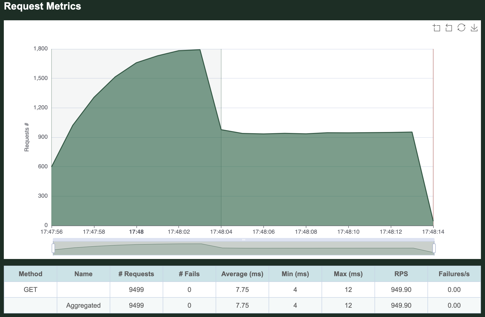
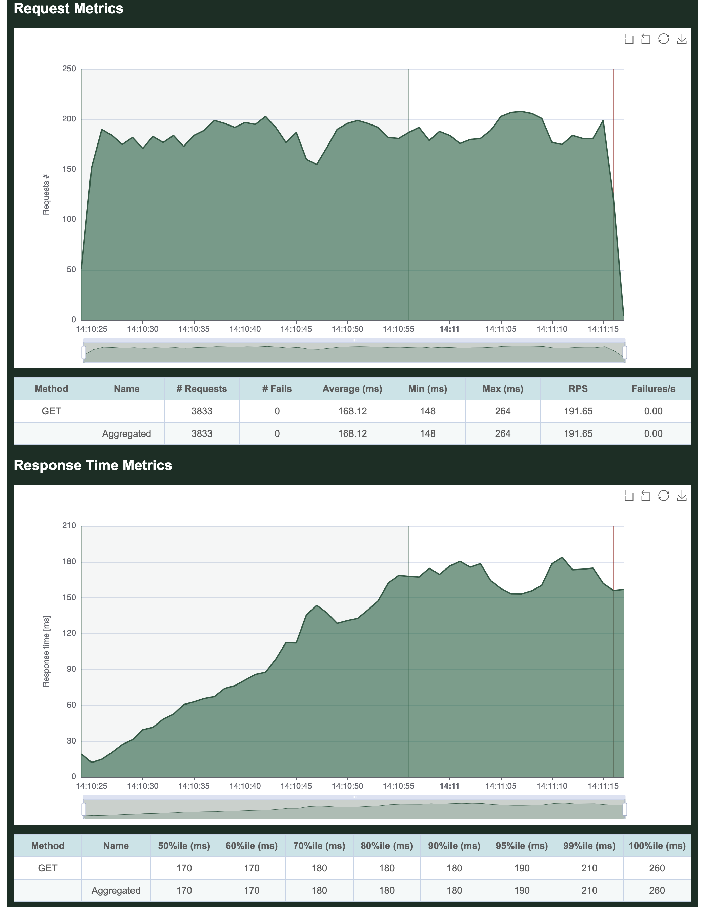
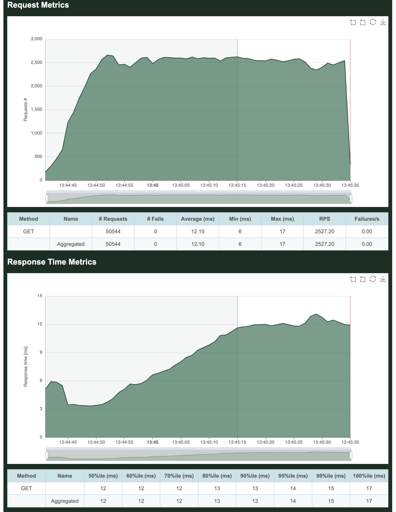
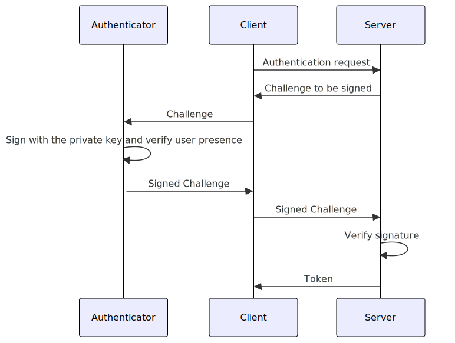

====================================
OpenStack Keystone rewritten in Rust
====================================

What do we get if we rewrite Keystone in Rust
=============================================

:Date: 2025-03-28
:Author: Artem Goncharov

Agenda
------

- What I was working on

- Keystone library for Rust

- Adding API

- Performance

- Demo 

- Way forward

What I was working on
---------------------

- Let OpenStack users (CSP customers) establish user federation (ldap, oidc) or
  similar without involving administrators.

- Federation using oidc is managed outside of Keystone itself (typically by
  mod_auth_oidc module) what limits integration capabilities.

- It is not trivially possible to reuse single external IdP by different
  customers while being themselves in a control of such integration.

- Modification of oidc federation requires restart of Keystone.

- Lack of SCIM (System for Cross-domain Identity Management) support

- Exchange JWT for an OpenStack token

- Lack of fine-granular access control (role explosion)

- Integrate external authorization systems. This is often necessary when
  OpenStack is just one offering in the service portfolio of the CSP.

- Lack of service accounts concept.

Keystone library for Rust
-------------------------

- AuthN/Z are complex

- Python libs for OIDC/Scim are rare and often unmaintained

- A standalone component (Keystone extension) addressing Federation issues (like federation authentication)

- SDK/CLI/TUI for OpenStack in Rust already exists and is useful (i.e. proxy to Keystone)

- Library for Keystone is necessary

  - issuing a token touches nearly every angle of Keystone: user, project,
    domain, role, assignments, Fernet, etc

  - direct access to the database is unavoidable

- CRUD for resource provider

- CRUD for identity provider

- CRUD for assignments provider

- cRud for catalog provider

- Fernet (decrypt/encrypt), msgpack (encode/decode)

Adding API to the lib
---------------------

Technically just peanuts compared to the lib itself

- token validation

- policy (not done yet)

- convert API request into the backend structure

- invoke backend method

- convert backend response to the API response

Performance 
-----------

- password hashing is slow, on purpose

- decrypt token

.. code:: python

   import pytest

   from keystone.token.providers.fernet.core import Provider
   from keystone.token.provider import Manager
   import keystone.conf
   from keystone.conf import configure

   CONF = keystone.conf.CONF

   @pytest.fixture(scope="session", autouse=True)
   def execute_before_any_test():
       configure(CONF)

   @pytest.mark.benchmark(group="group-name", timer=time.time, disable_gc=True, warmup=False)
   def test_fast(benchmark):
       manager = Manager()
       fernet = Provider()
       result = benchmark(lambda: fernet.validate_token(token))
       assert result

   token = "gAAAAABnuDa_xLN1n9DrJyv-uDfOD...."

====

Python

.. code:: console

   Linux
   =====
   -------------------------------------------- benchmark 'group-name': 1 tests ---------------------------------
   Name (time in us)          Min       Max      Mean   StdDev    Median      IQR  Outliers  OPS (Kops/s)  Rounds
   --------------------------------------------------------------------------------------------------------------
   test_fast             206.4705  315.6662  218.3426  11.8152  215.5304  11.6825     52;21        4.5800     498
   --------------------------------------------------------------------------------------------------------------

   Mac
   ===
   ------------------------------------------ benchmark 'group-name': 1 tests ------------------------------
   Name (time in us)         Min       Max     Mean  StdDev   Median     IQR  Outliers  OPS (Kops/s)  Rounds
   ---------------------------------------------------------------------------------------------------------
   test_fast             71.7640  124.9313  77.4613  3.8331  77.9629  4.7684    165;14       12.9097     685
   ---------------------------------------------------------------------------------------------------------

Rust

.. code:: console

   Linux
   =====
   fernet token/project    time:   [8.8575 µs 9.1288 µs 9.4079 µs]

   Mac
   ===
   fernet token/project    time:   [3.1311 µs 3.1386 µs 3.1465 µs]

Note: Mac numbers can not be compared with Linux

Get Users (Python)
------------------

Get Users (Rust)
------------------

Get Users (Python, 32 cores)
----------------------------

Get Users (Rust, 32 cores)
--------------------------

Overall sample performance improvement
--------------------------------------

.. code-block:: console

   ❯ hyperfine 'openstack --os-cloud dev-keystone user list'
   Benchmark 1: openstack --os-cloud dev-keystone user list
     Time (mean ± σ):     622.5 ms ±  64.5 ms    [User: 269.4 ms, System: 41.5 ms]
     Range (min … max):   591.5 ms … 800.8 ms    10 runs

   ❯ hyperfine 'osc --os-cloud dev-keystone identity user list'
   Benchmark 1: osc --os-cloud dev-keystone identity user list
     Time (mean ± σ):     107.6 ms ±  84.8 ms    [User: 6.0 ms, System: 3.3 ms]
     Range (min … max):    78.8 ms … 348.8 ms    10 runs

   ❯ hyperfine 'osc --os-cloud dev-keystone-rust identity user list'
   Benchmark 1: osc --os-cloud dev-keystone-rust identity user list
     Time (mean ± σ):      15.0 ms ±   1.5 ms    [User: 5.6 ms, System: 2.8 ms]
     Range (min … max):    12.6 ms …  27.1 ms    123 runs

Demo time
---------

Disclaimer:

- Passkey != SecurityKey

- Passkey != Passkey (Apple != Android != Windows)

- WebAuthN - `libs maintainers deilusionated <https://fy.blackhats.net.au/blog/2024-04-26-passkeys-a-shattered-dream/>`_

====

Roadmap
-------

- Make KeystoneNG additional deployment component (to be tightly integrated
  with Rust OSC)

- take care of advanced auth:

  - customer managed IdP 

  - Scim

  - JWT auth (i.e. GitHub workflow)

  - security key

- overtake Auth and token validation

- continuous closing of the functional gaps to Keystone

- `GitHub Repository <https://github.com/gtema/keystone>`_
