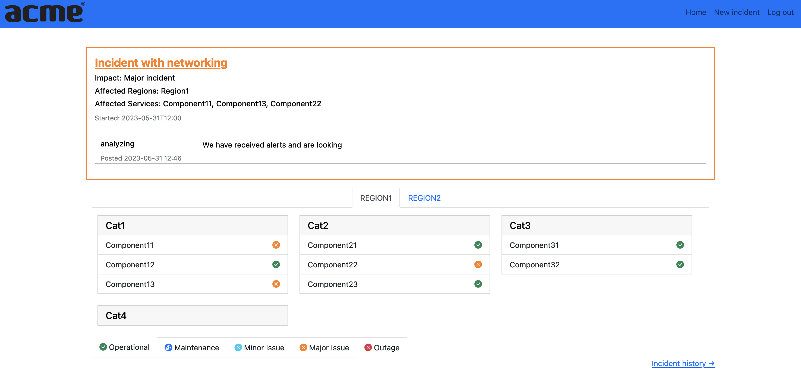
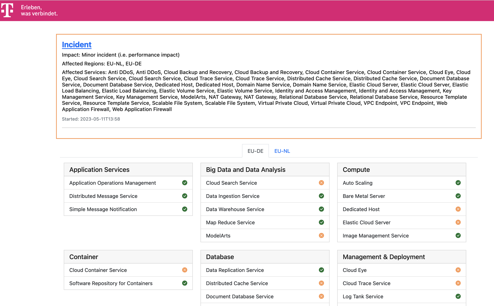

StackMon
========

StackMon
--------

**Observation platform for OpenStack based clouds**

* Artem Goncharov
* Nils Magnus

Agenda
------

- Why not ...XYZ
- What
- How

Why (and why not ...XYZ)
------------------------

What we wanted is:

  - Monitoring cloud from end user perspective
  - different metric physics (latencies, rates, occurences)
  - Events vs metrics
  - easy extensibility and readability and clarity
  - status page with SLA calculation (convert raw metrics into service status)
  - **not invent another another monitoring system**

What (are we doing)
-------------------

How (are we doing that)
-----------------------

  - Ansible playbook as a testing scenario
  - Metrics emited by OpenStackSDK under the hood
  - Additional metrics gathering plugins (i.e. static resources)
  - Metrics processed through StatsD and stored in Graphite
  - Metric Processor converts raw data into flags and semapthores with complex
    logic
  - Status dashboard visualizes service semaphores

High Level Design
-----------------

Testing options
---------------

  - ApiMon - Ansible driven playbook scheduler/executor
  - EpMon - Endpoint monitoring
  - xxx - Arbitrary testing container doing something and producing metrics

ApiMon
------

.. code:: yaml

   - name: Test Image
     hosts: localhost
     tasks:
       - block:
           - name: List Images
             openstack.cloud.image_info:

           - name: Get single Image
             openstack.cloud.image_info:
               image: "Standard_Fedora_38_latest"

           - name: Create directory for images
             ansible.builtin.file:
               name: /tmp/ansible/images
               state: directory
               recurse: true

           - name: Download cirros image
             ansible.builtin.get_url:
               url: https://download.cirros-cloud.net/0.6.0/cirros-0.6.0-x86_64-disk.img
               dest: /tmp/ansible/images/cirros.img
               validate_certs: false

           - name: Upload cirros image
             openstack.cloud.image:
               name: "{{ image_name }}"
               container_format: bare
               disk_format: qcow2
               is_protected: false
               filename: /tmp/ansible/images/cirros.img
             tags:
               - "metric=image_upload"

         always:
           - name: Delete cirros image
             openstack.cloud.image:
               name: "{{ image_name }}"
               state: absent
             tags:
               - "metric=image_delete"

EpMon
-----

Dummy GET requests to the URL of the endpoint

.. code:: yaml

   ...
   compute:
     service_type: compute
     urls:
     - /
     - /servers
     - /flavors
     - /limits
     - /os-keypairs
     - /os-server-groups
     - /os-availability-zone
   ...

Under the hood (OpenStackSDK)
-----------------------------

OpenStackSDK used by Ansible (ApiMon) and EpMon emits StatsD metrics.

For complex cases custom metrics are captured by Ansible callback plugin.

.. code:: yaml

   - name\: "Create Volume in {{ availability_zone }}"
     openstack.cloud.volume:
       state: present
       availability_zone: "{{ availability_zone | default(omit) }}"
       size: 10
       display_name: "{{ volume_name }}"
     tags:
       - "metric=create_volume"

Generic StackMon plugin
-----------------------

Data Flow
---------

Metric Processor
----------------

When is service degraded is is experiencing outage?

  - latency of GET requests is above x sec?
  - POST to provision new resource fails?
  - API not reachable?
  - provisioned resource can not be reached anymore?
  - error rate too high?
  - what if things work from one zone, but not from another?

Flags and Semaphores
--------------------

Status definition possibility (semaphores):

- outage is when `(X and Y) or Z`
- major incident is when `A and B`
- minor incident is when `A or B`

where (flags):

- A => `bool(avg(latency) > 1s)`
- B => `bool(avg(success_rate) < 50%)`
- X => `bool(percentage(error.5XX) == 100%)`
- ...

Status Dashboard
----------------

Status Dashboard (Theming)
--------------------------

Links
-----

- https://github.com/stackmon
- https://stackmon.github.io
